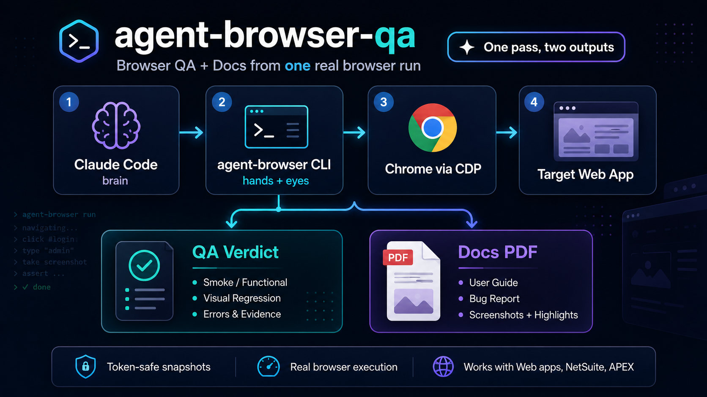
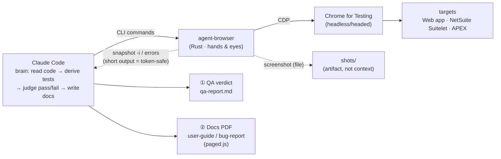

# agent-browser-qa

[](https://docs.anthropic.com/claude/docs/skills)
[](https://github.com/vercel-labs/agent-browser)
[](LICENSE)

<p align="center">
  
</p>

> A Claude Code / Agent **skill** for browser QA + documentation with [`agent-browser`](https://github.com/vercel-labs/agent-browser) — drive a real browser through a web flow once, get **two outputs**: a QA verdict **and** polished docs (user-guide / bug-report PDF).

Drive the browser with `agent-browser` (a Rust CLI over CDP) to run QA and generate docs from a **real run** — *one pass, two outputs*.

> **Note:** the reference files under [`references/`](references) are the author's dense working
> notes and are kept in Thai. This README and [`SKILL.md`](SKILL.md) are in English.

---

## Architecture overview



**Roles:** Claude = the brain (judges pass/fail, writes docs) · agent-browser = the hands & eyes (drives the browser + captures evidence, decides nothing). The CLI costs no tokens — tokens are only spent feeding output back into context, so favor **short-output** commands. Full diagrams for every flow: [`docs/ARCHITECTURE.md`](./docs/ARCHITECTURE.md)

---

## Process / flows at a glance

| Flow | Steps | Output |
|---|---|---|
| **Smoke QA** | `open` → `wait --load networkidle` → walk happy path → `errors` empty | pass / fail |
| **Functional QA** | action → **`scrollintoview` → `click`** → **assert state** (golden rule) | verdict per step |
| **Visual regression** | `screenshot` → `diff screenshot --baseline` | `diff.png` |
| **Error surfacing** | after every key step → `errors --json` + `console --json` | errors must surface, not stay silent |
| **User-guide PDF** | walk flow + embed highlight ring + screenshot → `guide-template.html` → `pdf` | guide PDF (cover / TOC / page numbers) |
| **Bug-report PDF** | repro + evidence + severity → `bug-report-template.html` → `pdf` | bug PDF (Steps/Expected/Actual) |

> **Golden rule:** `click` doesn't auto-scroll → `scrollintoview` first · don't trust `✓ Done` → always assert state. See [`references/gotchas.md`](references/gotchas.md)

---

## What it does

- **Browser QA** — smoke / functional / visual-regression / error-surfacing on any web app (login, checkout, wizard, form, grid), including NetSuite Suitelets & Oracle APEX.
- **Docs from the same run** — turn a tested flow into a **user-guide** or **bug-report PDF** (cover, TOC, page numbers, screenshots with highlight rings) using the included templates.
- **Hard-won gotchas baked in** — the traps that make automation *fail silently* are documented with reproductions + fixes.

## Key gotchas it protects against

| Trap | Symptom | Fix |
|---|---|---|
| `click` doesn't auto-scroll | button below fold → CLI `✓ Done` but **nothing happens** | `scrollintoview <sel>` before `click` |
| Don't trust `✓ Done` | command "succeeds" but has no effect | assert state after every action (`wait` / `get url` / `get text`) |
| `os error 10060` | `wait --text` / `wait <selector>` flakes on Windows | use `wait --load networkidle` + short state checks |
| headless has no Thai font | injected Thai labels render as boxes | put Thai text in the HTML, bake only the ring into the image |
| `pdf` double-pagination | paged.js PDF gets alternating blank pages | fit `@page size` + `.pagedjs_page` margin on screen only |

Full detail with evidence: [`references/gotchas.md`](references/gotchas.md)

---

## Install

**Option A — one file (easiest):** download `agent-browser-qa.skill` from the [**Releases**](https://github.com/wichtking/agent-browser-qa/releases) page and install it via the Claude Code skill installer.

**Option B — clone into your skills dir:**
```bash
git clone https://github.com/wichtking/agent-browser-qa.git ~/.claude/skills/agent-browser-qa
```

Then install the `agent-browser` CLI:
```bash
npm install -g agent-browser   # or brew / cargo install agent-browser
agent-browser install          # download Chrome for Testing (first time)
```

> Maintainers: the `.skill` bundle is a build artifact (not committed). Regenerate it with
> `python scripts/build-skill.py` and attach the output to a GitHub Release.

## Project structure

```
agent-browser-qa/
├── README.md                      ← this file
├── SKILL.md                       ← overview · golden rules · workflow
├── docs/
│   ├── ARCHITECTURE.md            ← workflow diagrams (mermaid) for every flow
│   └── TEAM-PROCESS.md            ← team playbook: lifecycle, release gate, RACI
├── references/                    ← dense working notes (Thai)
│   ├── gotchas.md                 ← silent-failure traps + fixes  ← the core
│   ├── test-design.md             ← what to test (adversarial coverage, Phase 0-3)
│   ├── commands.md                ← command reference + token discipline + batch
│   ├── flow-spec.md               ← write test cases as repeatable flow YAML
│   └── pdf-reports.md             ← paged.js recipe (TOC, page numbers, fixes)
├── assets/
│   ├── guide-template.html        ← user-guide PDF (edit the data array)
│   ├── bug-report-template.html   ← bug-report PDF (edit the bugs array)
│   ├── highlight.js               ← inject a highlight ring before screenshot
│   └── pointer.js                 ← place a pointer ring for video/live
└── scripts/
    └── build-skill.py             ← build the installable .skill bundle (for Releases)
```

## More docs

- 🏗️ [`docs/ARCHITECTURE.md`](./docs/ARCHITECTURE.md) — architecture + workflow diagrams (mermaid) for every flow
- 👥 [`docs/TEAM-PROCESS.md`](./docs/TEAM-PROCESS.md) — team playbook: lifecycle fit, release gate, RACI, artifacts
- 🪤 [`references/gotchas.md`](./references/gotchas.md) — real-world traps + fixes
- 🎯 [`references/test-design.md`](./references/test-design.md) — what to test (adversarial coverage)
- 🧰 [`references/commands.md`](./references/commands.md) — command reference + batch
- 🧾 [`references/flow-spec.md`](./references/flow-spec.md) — test cases as repeatable flow YAML
- 📄 [`references/pdf-reports.md`](./references/pdf-reports.md) — how to make PDFs (paged.js)

## Credits / built on

This skill is only a **playbook wrapping** an upstream tool — it does not reproduce or replace the CLI:

- 🧰 **[vercel-labs/agent-browser](https://github.com/vercel-labs/agent-browser)** — the Rust CLI that drives Chrome over CDP (the actual engine). This skill just collects usage + gotchas + doc templates. Credit and license for the CLI belong to the upstream authors.
- 🌐 Examples / evidence runs use **[saucedemo.com](https://www.saucedemo.com)** (the Sauce Labs demo app)
- 📄 PDF pagination via **[Paged.js](https://pagedjs.org/)**

## License

[MIT](LICENSE) © 2026 Wichit Wongta  ·  (the `agent-browser` CLI is under vercel-labs' own license)

*Templates and gotchas come from real runs on saucedemo.com with `agent-browser` 0.27.0 on Windows.*
