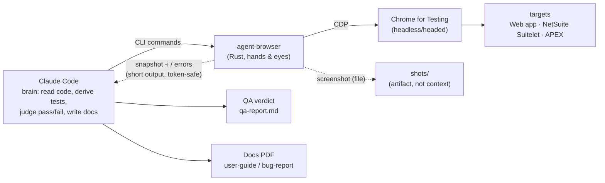

# agent-browser-qa

[](https://docs.anthropic.com/claude/docs/skills)
[](https://github.com/vercel-labs/agent-browser)
[](LICENSE)

<p align="center">
  
</p>

A Claude Code skill for browser QA and documentation, built on [`agent-browser`](https://github.com/vercel-labs/agent-browser). Drive a real browser through a flow once and get two things back: a QA verdict, and a polished user guide or bug report.

The reference files under [`references/`](references) are working notes kept in Thai. This README and [`SKILL.md`](SKILL.md) are in English.

## How it works

Claude reads the code, derives the tests, and judges pass or fail. `agent-browser` (a Rust CLI over CDP) does the driving and captures the evidence. Its output never enters the model's context on its own, so a full pass stays cheap; favor short-output commands to keep it that way.



Full diagrams for every flow are in [`docs/ARCHITECTURE.md`](./docs/ARCHITECTURE.md).

## Flows

| Flow | Steps | Output |
|---|---|---|
| Smoke QA | `open` → `wait --load networkidle` → walk happy path → `errors` empty | pass / fail |
| Functional QA | action → `scrollintoview` → `click` → assert state | verdict per step |
| Visual regression | `screenshot` → `diff screenshot --baseline` | `diff.png` |
| Error surfacing | after every key step → `errors --json` + `console --json` | errors surface, not silent |
| User-guide PDF | walk flow, highlight, screenshot → `guide-template.html` → `pdf` | guide PDF (cover, TOC, page numbers) |
| Bug-report PDF | repro, evidence, severity → `bug-report-template.html` → `pdf` | bug PDF (Steps/Expected/Actual) |

Golden rule: `click` does not auto-scroll, so call `scrollintoview` first; and don't trust `✓ Done`, always assert the resulting state. Details in [`references/gotchas.md`](references/gotchas.md).

## Features

- **One pass, two outputs.** A single run gives you the QA verdict and the docs together, so nothing needs a second walkthrough.
- **Real pages, not mocks.** It drives actual Chrome over CDP against any web app, including NetSuite Suitelets and Oracle APEX, headless or headed.
- **Deliberate test design.** A Phase 0–3 method turns code and acceptance criteria into a coverage matrix, and states up front which cases a browser can verify and which must come from a code review.
- **Four QA layers.** Smoke, functional, visual regression, and error surfacing.
- **Guards against silent failures.** The traps that let automation pass when it shouldn't (below-fold clicks, a fake `✓ Done`, `os 10060`) are written up with reproductions and fixes.
- **Token-aware.** Assertions are short commands and screenshots are saved to files, so testing a large app doesn't fill the context window.
- **Reproducible specs.** Test cases live as YAML with `requirement` and `acceptance` fields, so a requirement, its test, and its guide share one id.
- **Documents that ship.** User guides and bug reports export to PDF with a cover, table of contents, page numbers, and highlighted screenshots.
- **Records runs.** Capture a flow as video, watch it live, or add a pointer ring so the recording shows where each action lands.
- **Fits a team.** A lifecycle playbook, a release gate, and a RACI table live in [`docs/TEAM-PROCESS.md`](docs/TEAM-PROCESS.md).

## Gotchas it protects against

| Trap | Symptom | Fix |
|---|---|---|
| `click` doesn't auto-scroll | button below fold → CLI `✓ Done` but nothing happens | `scrollintoview <sel>` before `click` |
| Don't trust `✓ Done` | command succeeds but has no effect | assert state after every action (`wait` / `get url` / `get text`) |
| `os error 10060` | `wait --text` / `wait <selector>` flakes on Windows | use `wait --load networkidle` + short state checks |
| headless has no Thai font | injected Thai labels render as boxes | put Thai text in the HTML, bake only the ring into the image |
| `pdf` double-pagination | paged.js PDF gets alternating blank pages | fit `@page size` + `.pagedjs_page` margin on screen only |

Full detail with evidence: [`references/gotchas.md`](references/gotchas.md).

## Install

Option A, one file: download `agent-browser-qa.skill` from the [Releases](https://github.com/wichtking/agent-browser-qa/releases) page and install it through the Claude Code skill installer.

Option B, clone into your skills directory:
```bash
git clone https://github.com/wichtking/agent-browser-qa.git ~/.claude/skills/agent-browser-qa
```

Then install the `agent-browser` CLI:
```bash
npm install -g agent-browser   # or brew / cargo install agent-browser
agent-browser install          # download Chrome for Testing (first time)
```

Requirements: Node.js for `npm install -g`; `ffmpeg` only if you use `record` for video; Python 3.10+ and `git` only if you build the `.skill` bundle. Verified with `agent-browser` 0.27.x. For other versions, run `agent-browser skills get core --full` for version-matched syntax.

Maintainers: the `.skill` bundle is a build artifact and is not committed. Rebuild it with `python scripts/build-skill.py` and attach the output to a GitHub Release.

## Quick start

Confirm your setup with a short smoke run: open a page, assert, check for errors, screenshot.

```bash
agent-browser batch \
  "open https://example.com" \
  "wait --load networkidle" \
  "get title" \
  "errors" --json
agent-browser screenshot hello.png     # evidence file: the image, not context
```

Expect a JSON array where each command reports `"success": true`, the title contains `Example Domain`, and `errors` is empty.

The first run is slow: a cold browser session can take one to two minutes to start on Windows, and may look like it hung when it hasn't. Keep the session warm and reuse it. If commands keep failing with `os error 10060`, clear the stale session file (see [`references/gotchas.md`](references/gotchas.md), section 3).

For a real multi-step flow, see [`examples/saucedemo.yaml`](examples/saucedemo.yaml) and [`references/flow-spec.md`](references/flow-spec.md).

## Project structure

```
agent-browser-qa/
├── README.md                      this file
├── SKILL.md                       overview, golden rules, workflow
├── docs/
│   ├── ARCHITECTURE.md            workflow diagrams (mermaid) for every flow
│   └── TEAM-PROCESS.md            team playbook: lifecycle, release gate, RACI
├── references/                    working notes (Thai)
│   ├── gotchas.md                 silent-failure traps and fixes
│   ├── test-design.md             what to test (adversarial coverage, Phase 0-3)
│   ├── commands.md                command reference, token discipline, batch
│   ├── flow-spec.md               test cases as repeatable flow YAML
│   └── pdf-reports.md             paged.js recipe (TOC, page numbers, fixes)
├── assets/
│   ├── guide-template.html        user-guide PDF (edit the data array)
│   ├── bug-report-template.html   bug-report PDF (edit the bugs array)
│   ├── highlight.js               inject a highlight ring before screenshot
│   └── pointer.js                 place a pointer ring for video/live
├── examples/
│   └── saucedemo.yaml             runnable flow (happy path + adversarial)
└── scripts/
    └── build-skill.py             build the installable .skill bundle
```

## More docs

- [`docs/ARCHITECTURE.md`](./docs/ARCHITECTURE.md) — architecture and workflow diagrams for every flow
- [`docs/TEAM-PROCESS.md`](./docs/TEAM-PROCESS.md) — team playbook: lifecycle, release gate, RACI, artifacts
- [`references/gotchas.md`](./references/gotchas.md) — traps and fixes
- [`references/test-design.md`](./references/test-design.md) — what to test (adversarial coverage)
- [`references/commands.md`](./references/commands.md) — command reference and batch
- [`references/flow-spec.md`](./references/flow-spec.md) — test cases as repeatable flow YAML
- [`references/pdf-reports.md`](./references/pdf-reports.md) — how to make PDFs (paged.js)

## Credits

This skill is a playbook around an upstream tool; it does not reproduce or replace the CLI.

- [vercel-labs/agent-browser](https://github.com/vercel-labs/agent-browser) — the Rust CLI that drives Chrome over CDP. This skill collects usage, gotchas, and doc templates around it. Credit and license for the CLI belong to the upstream authors.
- [saucedemo.com](https://www.saucedemo.com) — the Sauce Labs demo app used for examples and evidence runs.
- [Paged.js](https://pagedjs.org/) — PDF pagination.

## License

[MIT](LICENSE) © 2026 Wichit Wongta. The `agent-browser` CLI is under vercel-labs' own license.
