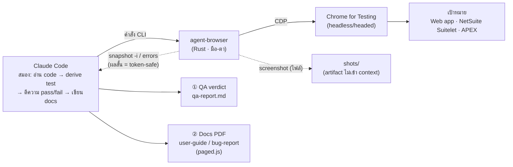

# agent-browser-qa

[](https://docs.anthropic.com/claude/docs/skills)
[](https://github.com/vercel-labs/agent-browser)
[](LICENSE)

> Claude Code / Agent **skill** for browser QA + documentation with [`agent-browser`](https://github.com/vercel-labs/agent-browser) — drive a real browser through a web flow once, get **two outputs**: a QA verdict **and** polished docs (user-guide / bug-report PDF).

ขับ browser อัตโนมัติด้วย `agent-browser` (Rust CLI ผ่าน CDP) เพื่อทำ QA และสร้างเอกสารจาก **การรันจริง** — *one pass, two outputs*.

---

## ภาพรวมสถาปัตยกรรม



**บทบาท:** Claude = สมอง (ตัดสิน pass/fail, เขียนเอกสาร) · agent-browser = มือ-ตา (ขับ browser + เก็บหลักฐาน ไม่ตัดสินอะไร). CLI ไม่กิน token — token เกิดเฉพาะตอน feed ผลกลับ context จึงใช้คำสั่ง **ผลสั้น** เป็นหลัก. แผนภาพเต็มทุก flow: [`docs/ARCHITECTURE.md`](./docs/ARCHITECTURE.md)

---

## Process / Flows โดยย่อ

| Flow | ขั้นตอน | output |
|---|---|---|
| **Smoke QA** | `open` → `wait --load networkidle` → เดิน happy path → `errors` ว่าง | pass / fail |
| **Functional QA** | action → **`scrollintoview` → `click`** → **assert state** (กฎทอง) | verdict ต่อ step |
| **Visual regression** | `screenshot` → `diff screenshot --baseline` | `diff.png` |
| **Error surfacing** | หลังทุก step สำคัญ → `errors --json` + `console --json` | error ต้องโผล่ ไม่เงียบ |
| **User-guide PDF** | เดิน flow + ฝังกรอบไฮไลต์ + screenshot → `guide-template.html` → `pdf` | guide PDF (ปก/สารบัญ/เลขหน้า) |
| **Bug-report PDF** | repro + evidence + severity → `bug-report-template.html` → `pdf` | bug PDF (Steps/Expected/Actual) |

> **กฎทอง:** `click` ไม่ auto-scroll → ต้อง `scrollintoview` ก่อน · อย่าเชื่อ `✓ Done` → assert state เสมอ. ดู [`references/gotchas.md`](references/gotchas.md)

---

## What it does

- **Browser QA** — smoke / functional / visual-regression / error-surfacing บน web app ใดๆ (login, checkout, wizard, form, grid) รวม NetSuite Suitelet & Oracle APEX.
- **Docs from the same run** — แปลง flow ที่เทสแล้วเป็น **user-guide** หรือ **bug-report PDF** (ปก, สารบัญ, เลขหน้า, screenshot มีกรอบไฮไลต์) ด้วย template ที่ให้มา.
- **Hard-won gotchas baked in** — กับดักที่ทำให้ automation *พังเงียบ* ถูกบันทึกพร้อม reproduction + วิธีแก้.

## Key gotchas it protects against

| Trap | Symptom | Fix |
|---|---|---|
| `click` doesn't auto-scroll | ปุ่มใต้ fold → CLI `✓ Done` แต่ **ไม่เกิดอะไร** | `scrollintoview <sel>` ก่อน `click` |
| Don't trust `✓ Done` | คำสั่ง "สำเร็จ" แต่ไม่เกิดผล | assert state หลังทุก action (`wait` / `get url` / `get text`) |
| `os error 10060` | `wait --text` / `wait <selector>` flake บน Windows | ใช้ `wait --load networkidle` + เช็ค state สั้นๆ |
| headless ไม่มีฟอนต์ไทย | ป้ายไทยที่ inject เป็นกล่อง | ใส่ข้อความไทยใน HTML, ฝังลงรูปแค่กรอบ |
| `pdf` double-pagination | paged.js PDF ได้หน้าว่างสลับ | `@page size` พอดี + margin `.pagedjs_page` เฉพาะ screen |

ฉบับเต็มพร้อมหลักฐาน: [`references/gotchas.md`](references/gotchas.md)

---

## Install

**Option A — one file (easiest):** download [`agent-browser-qa.skill`](agent-browser-qa.skill) แล้วติดตั้งผ่าน skill installer ของ Claude Code

**Option B — clone เข้า skills dir:**
```bash
git clone https://github.com/wichtking/agent-browser-qa.git ~/.claude/skills/agent-browser-qa
```

จากนั้นติดตั้งตัว `agent-browser` CLI:
```bash
npm install -g agent-browser   # หรือ brew / cargo install agent-browser
agent-browser install          # โหลด Chrome for Testing (ครั้งแรก)
```

## โครงสร้างโปรเจกต์

```
agent-browser-qa/
├── README.md                      ← ไฟล์นี้
├── SKILL.md                       ← overview · golden rules · workflow
├── docs/
│   └── ARCHITECTURE.md            ← workflow diagrams (mermaid) ทุก flow
├── references/
│   ├── gotchas.md                 ← กับดัก silent-failure + วิธีแก้  ← หัวใจ
│   ├── commands.md                ← command reference + token discipline
│   └── pdf-reports.md             ← paged.js recipe (TOC, เลขหน้า, fixes)
├── assets/
│   ├── guide-template.html        ← user-guide PDF (แก้ data array)
│   ├── bug-report-template.html   ← bug-report PDF (แก้ bugs array)
│   └── highlight.js               ← inject กรอบไฮไลต์ก่อน screenshot
└── agent-browser-qa.skill         ← packaged, ติดตั้งไฟล์เดียว
```

## เอกสารเพิ่มเติม

- 🏗️ [`docs/ARCHITECTURE.md`](./docs/ARCHITECTURE.md) — สถาปัตยกรรม + workflow diagrams (mermaid) ทุก flow
- 🪤 [`references/gotchas.md`](./references/gotchas.md) — กับดักที่เจอจริง + วิธีแก้
- 🧰 [`references/commands.md`](./references/commands.md) — command reference
- 📄 [`references/pdf-reports.md`](./references/pdf-reports.md) — วิธีทำ PDF (paged.js)

## Credits / Built on

skill นี้เป็นเพียง **playbook ที่ห่อหุ้มการใช้งาน** เครื่องมือต้นทาง — ไม่ได้ทำซ้ำหรือแทนที่ตัว CLI:

- 🧰 **[vercel-labs/agent-browser](https://github.com/vercel-labs/agent-browser)** — Rust CLI ที่ขับ Chrome ผ่าน CDP (ตัว engine จริงทั้งหมด). skill นี้แค่รวบรวมวิธีใช้ + กับดัก + template เอกสาร. เครดิตและลิขสิทธิ์ของ CLI เป็นของผู้พัฒนา upstream.
- 🌐 ตัวอย่าง/หลักฐานรันจาก **[saucedemo.com](https://www.saucedemo.com)** (Sauce Labs demo app)
- 📄 PDF pagination ด้วย **[Paged.js](https://pagedjs.org/)**

## License

[MIT](LICENSE) © 2026 Wichit Wongta  ·  (ตัว `agent-browser` CLI อยู่ภายใต้ลิขสิทธิ์ของ vercel-labs)

*Templates และ gotchas มาจากการรันจริงบน saucedemo.com ด้วย `agent-browser` 0.27.0 บน Windows.*
