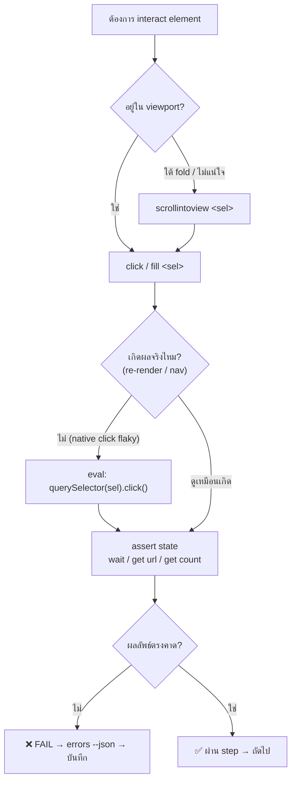
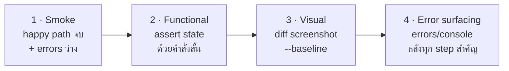
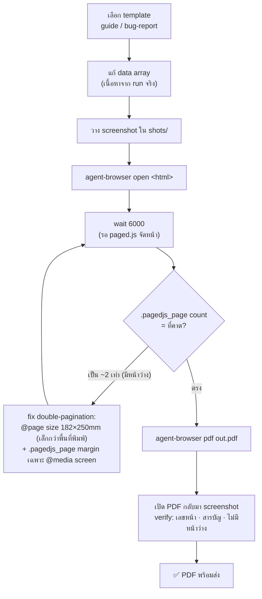
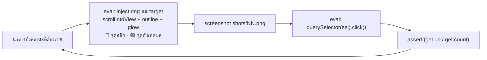

# ARCHITECTURE — agent-browser-qa

สถาปัตยกรรม + workflow diagrams (mermaid) ทุก flow. GitHub render mermaid ได้ในตัว.
สรุปสั้นอยู่ใน [`../README.md`](../README.md) · กับดัก/วิธีแก้ดู [`../references/gotchas.md`](../references/gotchas.md)

## TOC
1. [ภาพรวม: one pass, two outputs](#1-ภาพรวม-one-pass-two-outputs)
2. [Golden-rule action loop (click อย่างปลอดภัย)](#2-golden-rule-action-loop)
3. [QA 4 ชั้น](#3-qa-4-ชั้น)
4. [User-guide / Bug-report PDF pipeline (paged.js)](#4-pdf-pipeline-pagedjs)
5. [Highlight capture sub-flow](#5-highlight-capture-sub-flow)
6. [เป้าหมาย & setup (Web / NetSuite / APEX)](#6-เป้าหมาย--setup)

---

## 1. ภาพรวม: one pass, two outputs

เดิน happy path **รอบเดียว** → แตกเป็น (1) QA verdict และ (2) วัตถุดิบเอกสาร. Claude เป็นสมอง,
agent-browser เป็นมือ-ตา, CDP คุย Chrome. ใช้คำสั่ง **ผลสั้น** เพื่อกัน context ล้น.

```mermaid
sequenceDiagram
    participant U as ผู้ใช้
    participant C as Claude (สมอง)
    participant A as agent-browser (มือ-ตา)
    participant B as Chrome / CDP
    U->>C: "QA หน้า X แล้วทำคู่มือ/รายงาน"
    C->>A: open <url> ; wait --load networkidle
    A->>B: นำทาง + รอจน idle
    loop ทุก step
        C->>A: scrollintoview → screenshot (ไฟล์)
        C->>A: click / fill  (หรือ JS click ถ้า flaky)
        A->>B: ทำ action
        C->>A: assert (wait / get url / get text / get count)
        C->>A: errors --json
        A-->>C: ผลสั้น (token-safe)
    end
    C->>C: ① qa-report.md (verdict + ตาราง step)
    C->>C: ② HTML (template) + paged.js → pdf
    C-->>U: QA verdict + PDF (guide / bug-report)
```

---

## 2. Golden-rule action loop

หัวใจที่กัน **false pass**: เลื่อนเข้า viewport ก่อนคลิก, ถ้า native click ไม่ติดให้ใช้ JS click,
แล้ว **assert ผลลัพธ์เสมอ** — อย่าเชื่อ `✓ Done`.



---

## 3. QA 4 ชั้น



| ชั้น | ทำเมื่อ | คำสั่งหลัก | เกณฑ์ผ่าน |
|---|---|---|---|
| Smoke | ทุก commit | `open` · `wait` · `errors` | flow จบ + errors ว่าง |
| Functional | feature สำคัญ | `is` · `get` · `wait` | state ตรงคาดทุก step |
| Visual | UI เปลี่ยน | `diff screenshot --baseline` | diff อยู่ในเกณฑ์ |
| Error surfacing | ทุก step สำคัญ | `errors --json` · `console --json` | error ต้องโผล่ ไม่กลืน |

---

## 4. PDF pipeline (paged.js)

`agent-browser pdf` ไม่มี option margin/paper → ใช้ **paged.js** ทำสารบัญ+เลขหน้าจริง.
กับดักหลักคือ **double-pagination** (หน้าว่างสลับ) — แก้ที่ `@page size` + margin เฉพาะ screen.



รายละเอียด recipe เต็ม: [`../references/pdf-reports.md`](../references/pdf-reports.md)

---

## 5. Highlight capture sub-flow

เก็บ screenshot ที่มีกรอบไฮไลต์ชี้จุดคลิก — ฝัง **เฉพาะกรอบ** (ไม่มีข้อความไทย เพราะ headless
ไม่มีฟอนต์ไทย) แล้วขับ flow ด้วย JS click ให้ชัวร์.



snippet: [`../assets/highlight.js`](../assets/highlight.js)

---

## 6. เป้าหมาย & setup

| Target | setup / auth | locator strategy | ข้อควรระวัง |
|---|---|---|---|
| **Web app ทั่วไป** | `open <url>` | `@ref` จาก `snapshot -i` หรือ `[data-test=...]` | scrollintoview ก่อน click ปุ่มใต้ fold |
| **NetSuite Suitelet** | `--profile "Work"` (reuse session, เลี่ยง 2FA) | `@ref` / css; element ใน iframe → `frame "#sel"` แล้ว `frame main` | โหลด async → `wait --fn "window.jQuery && jQuery.active===0"` |
| **Oracle APEX** | `--session porjai` (isolated) | semantic: `find label "..." fill "..."` / `find role button click --name "..."` (IG dynamic) | ทดสอบ Thai input ทุกครั้ง; `vitals --json` ถ้ามีใน version นั้น |

---

*แผนภาพทั้งหมดมาจาก workflow จริงที่ใช้ทำ QA + เอกสารด้วย agent-browser 0.27.0 บน Windows.*
