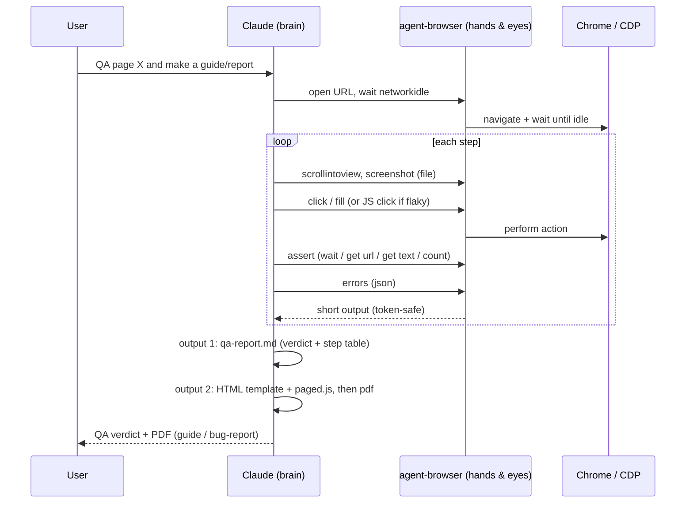
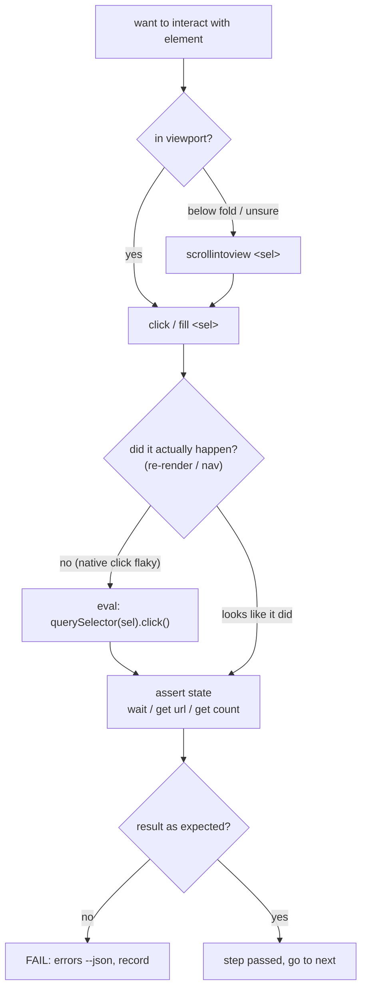
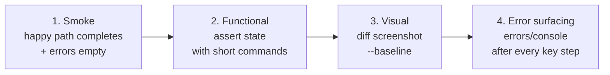
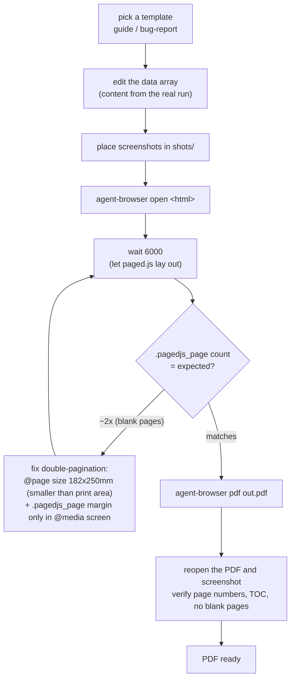
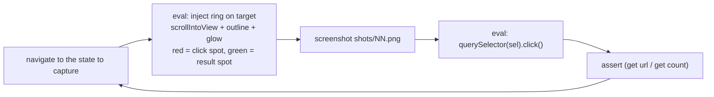

# Architecture

Workflow diagrams for every flow. GitHub renders mermaid natively. A short summary is in
[`../README.md`](../README.md); traps and fixes are in [`../references/gotchas.md`](../references/gotchas.md).

## Contents
1. [Overview: one pass, two outputs](#1-overview-one-pass-two-outputs)
2. [Golden-rule action loop](#2-golden-rule-action-loop)
3. [Four QA layers](#3-four-qa-layers)
4. [PDF pipeline (paged.js)](#4-pdf-pipeline-pagedjs)
5. [Highlight capture sub-flow](#5-highlight-capture-sub-flow)
6. [Targets and setup](#6-targets-and-setup)

---

## 1. Overview: one pass, two outputs

Walk the happy path once, then split it into two outputs: a QA verdict and documentation material.
Claude is the brain, agent-browser is the hands and eyes, and CDP talks to Chrome. Use short-output
commands to avoid context overflow.

---

## 2. Golden-rule action loop

The core idea that prevents a false pass: scroll into the viewport before clicking, fall back to a JS
click if the native click does not land, then always assert the result rather than trusting `✓ Done`.

---

## 3. Four QA layers

| Layer | When | Main commands | Pass criteria |
|---|---|---|---|
| Smoke | every commit | `open`, `wait`, `errors` | flow completes, errors empty |
| Functional | key features | `is`, `get`, `wait` | state matches at every step |
| Visual | UI changes | `diff screenshot --baseline` | diff within threshold |
| Error surfacing | every key step | `errors --json`, `console --json` | errors surface, not swallowed |

---

## 4. PDF pipeline (paged.js)

`agent-browser pdf` has no margin or paper option, so paged.js supplies a real table of contents and
page numbers. The main trap is double-pagination (alternating blank pages), fixed with `@page size`
and a screen-only margin.

Full recipe: [`../references/pdf-reports.md`](../references/pdf-reports.md)

---

## 5. Highlight capture sub-flow

Capture screenshots with a highlight ring on the click target. Bake in only the ring (no Thai text,
since headless has no Thai font), then drive the flow with a JS click for reliability.

Snippet: [`../assets/highlight.js`](../assets/highlight.js)

---

## 6. Targets and setup

| Target | Setup / auth | Locator strategy | Watch out for |
|---|---|---|---|
| Generic web app | `open <url>` | `@ref` from `snapshot -i` or `[data-test=...]` | scrollintoview before clicking below-fold buttons |
| NetSuite Suitelet | `--profile "<your-profile>"` (reuse session, avoid 2FA) | `@ref` or css; for iframe elements use `frame "#sel"` then `frame main` | async loads: `wait --fn "window.jQuery && jQuery.active===0"` |
| Oracle APEX | `--session <name>` (isolated) | semantic: `find label "..." fill "..."`, `find role button click --name "..."` (dynamic IG) | test Thai input every time; `vitals --json` if present in that version |

---

The diagrams reflect the real workflow used with agent-browser 0.27.0 on Windows.
