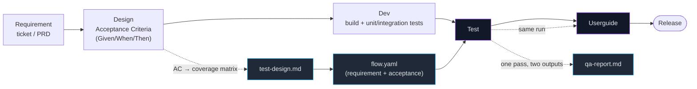

# TEAM-PROCESS — using agent-browser-qa across the lifecycle

This skill is a **Test + Userguide engine**, not a full SDLC tool. This doc is the playbook for
wiring it into a team's flow: Requirement → Design → Dev → Test → Userguide. It defines the
bridges, the boundaries, ownership, and the release gate — so results are consistent and traceable
no matter who (or whose agent) runs it.

> One rule to remember: **agent-browser-qa is the acceptance + exploratory + docs pass, run by a
> person + agent before a release. It is NOT the deterministic CI regression suite.** Keep those two
> separate (see §4).

---

## Where the tool fits



**Solid path** = the team's flow. **Dotted path** = where this skill plugs in — it consumes
Acceptance Criteria and produces both a QA verdict and the user guide from the *same* run.

---

## Stage-by-stage

### 1. Requirement → Acceptance Criteria (the Design bridge)
- Every requirement/ticket becomes one or more **Acceptance Criteria** in Given/When/Then form.
- AC are the objective source of "what must be true." They catch **missing-feature** bugs that
  code-based test design cannot (you can't derive a test for code that was never written).
- Record the ticket id — it will flow all the way to the guide.

### 2. Design (test design)
- Feed AC **and** the code into [`../references/test-design.md`](../references/test-design.md):
  AC → the happy/functional coverage; code → branch/edge/adversarial coverage the AC doesn't spell out.
- Use its **✅ in-browser vs. ⚠️ derive-from-code** split as a **contract with Dev** (see §3).

### 3. Dev (what belongs where — avoid overlap and gaps)
| Concern | Owner | Where it's tested |
|---|---|---|
| ✅ Rendered UI behavior, forms, navigation, visual, error-surfacing | QA (this skill) | `flow.yaml` scenarios |
| ⚠️ Logic boundaries, race/concurrency, governance, SQL, rollback | Dev | unit / integration tests |
- The `⚠️` rows in `test-design.md` are **explicitly not** covered by the browser — Dev must cover
  them, and the QA report should cite them as "verified by dev tests / unverified in browser", never
  mark them Pass.

### 4. Test — two distinct roles, kept separate
| | agent-browser-qa | CI regression suite (Playwright/Cypress) |
|---|---|---|
| Trigger | before a release, person + agent | every commit, headless, deterministic |
| Goal | acceptance + exploratory + **docs** | fast pass/fail gate, no flakiness tolerated |
| Environment | dev machine (Windows cold-start/10060 realities) | clean CI runner |
| Output | qa-report.md + user guide + bug reports | red/green |

Do **not** turn `flow.yaml` runs into the CI suite — the gotchas (ffmpeg, session stalls, os 10060)
are single-machine realities that make it flaky in CI. A stable subset of flows *can* be ported to
Playwright for CI, but that is a separate, deterministic artifact.

### 5. Userguide — regenerate every release (fight drift)
- The guide comes from a **real run**, so it is only correct for the UI at run time. **A UI change
  silently invalidates the guide.** Make "regenerate the guide" part of the release checklist, not a
  one-time task.

---

## Release gate (sign-off rule)

A release is **blocked** until:
1. Every Acceptance Criterion maps to a scenario that **ran** (no "not tested" on an AC).
2. The **adversarial pass ran** (not just smoke) for changed areas.
3. No **Critical** or **High** severity bug is open. Medium/Low may ship with a tracked ticket.
4. The user guide was **regenerated** if any covered UI changed.

Severity guide: **Critical** = data loss / wrong money / security · **High** = core AC broken, no
workaround · **Medium** = AC works but with a workaround · **Low** = cosmetic.

---

## Ownership (RACI)

| Activity | Responsible | Accountable | Consulted | Informed |
|---|---|---|---|---|
| Write Acceptance Criteria | BA / PO | PO | Dev, QA | Team |
| Dev unit/integration (⚠️ rows) | Dev | Tech Lead | QA | — |
| Author `flow.yaml` + run QA | QA (+ agent) | QA Lead | Dev | PO |
| Review `qa-report.md` | Tech Lead | QA Lead | Dev | PO |
| Release gate sign-off | QA Lead | PO | Tech Lead | Team |
| Regenerate user guide | QA (+ agent) | QA Lead | — | Support / PO |

---

## Artifacts — where they live

Version QA artifacts **with the feature, in the app repo** (not on one person's machine):
```
<app-repo>/qa/<feature>/
  flow.yaml            # scenarios with requirement + acceptance
  run-log.json         # batch --json output (audit trail)
  baseline/            # visual-regression baselines (versioned)
  shots/               # per-step screenshots
  qa-report.md         # verdict + severity, cites ticket ids
  guide/               # generated user guide (regenerated per release)
```
This makes coverage auditable (req → scenario → report → guide all carry the same ticket id) and lets
anyone re-run or diff a flow.

---

*This skill supplies the Test + Userguide engine and the gotchas that keep any teammate's run honest.
This process supplies the bridges (AC, traceability), the boundary (acceptance vs. CI), and the gate.*
